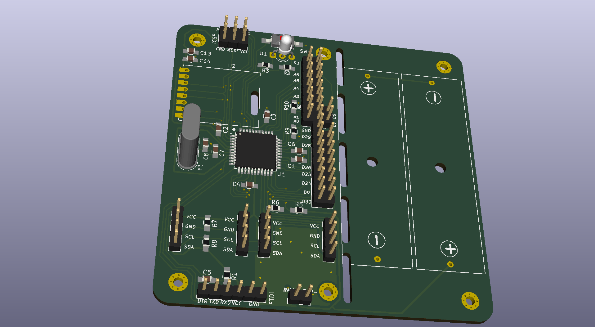

# PCB
## HB-UNI-SEN-BATT
Eine universelle Platine für Homebrew Geräte basierend auf [AskSin++ Library](https://github.com/pa-pa/AskSinPP)

[Schaltplan](HB-UNI-SEN-BATT/HB-UNI-SEN-BATT.pdf)

### Benötigte Bauteile:
* Arduino Pro Mini 3.3V 8Mhz (The Simple)
* CC1101 Modulplatine 868MHz
* 2x LEDs 3mm Low Current (Pin 4 und 5)
* 2x 470Ohm Widerstände (Vorwiderstand für LEDs)
* Elko 100uF 1,5mm
* 2x Goobay Batteriehalter Mignon Print
* Mikroschalter 6*6mm
* Stiftleiste RM 2mm 1x8 Pin (Für CC1101)
* Stiftleiste RM 2,54MM (nach Bedarf)
* IRLU024N (optional für Verpolungsschutz)
* 100KOhm Widerstand (optional für Verpolungsschutz)
* 2x 10KOhm Widerstand (optional Pullup für I2C)

### Passendes Gehäuse
* Camdenboss CBRS01SWH und CBRS01VWH

### Hinweise
* Achtung: Kein Überspannungschutz vorhanden
* Der Verpolungsschutz ist optional. Dafür Bauteil Q1 (IRLU024N) und R3 (100KOhm Widerstand) bestücken. Alternativ J8 auf der Platinenrückseite brücken um ohne Verpolungsschutz zu arbeiten.

## HB-UNI-SEN-PCB
Eine universelle Platine für Homebrew Geräte basierend auf [AskSin++ Library](https://github.com/pa-pa/AskSinPP)

[Schaltplan](HB-UNI-SEN-PCB/HB-UNI-SEN-PCB.pdf)

### Benötigte Bauteile:
* Arduino Pro Mini 3.3V 8Mhz (The Simple)
* CC1101 Modulplatine 868MHz
* 1x LEDs 3mm Low Current (Pin 4)
* 1x 470Ohm Widerstände (Vorwiderstand für LEDs)
* Mikroschalter 6*6mm
* Stiftleiste RM 2mm 1x8 Pin (Für CC1101)
* Stiftleiste RM 2,54MM (nach Bedarf)
* Optional: 2x 10KOhm Widerstand und 2x 10KOhm PTC (Temperaturmessung mit PTC an A0 und A1)

### Hinweise
* Achtung: kein Verpolungs- oder Überspannungschutz vorhanden
* Am I2C sind keine Pullups vorhanden, da diese im Regelfall auf I2C Platinen bereits integriert sind
* Aktuell fehlt noch ein Kondensator am VCC vom CC1101.

## HB-UNI-644 (Rev. 2)
Eine universelle Platine für Homebrew Geräte basierend auf [AskSin++ Library](https://github.com/pa-pa/AskSinPP) und dem ATmega644PA

[Schaltplan](HB-UNI-644/HB-UNI-644.pdf)

### Benötigte Bauteile:
#### Grundfunktion
* ATmega644PA oder ATmega1284P (TQFP44) (U1)
* CC1101 Modulplatine 868MHz ggf. mit RM 2.0 Pinheader (U2)
* 1x Kerko 10uF 0805 (C13)
* 7x Kerko 10nF 0805 (C1-C6, C14)
* 2x Widerstand 330 Ohm 0805 (R2, R3)
* 1x Widerstand 10K Ohm 0805 (R1)
* 1x Triple Color LED Common Cathode THT (D1)
* 1x Tactile Switch 2 Pin 6x3.5 SMD (SW1)
* 1x Quarz 8 Mhz HC49 THT (Y1) (optional)
* 2x Kerko 22pF 0805 (C7, C8) (optional für Quarz)
* Pinheader nach Bedarf

#### Power Option 1: Batteriebetrieb mit Step-Up
* 2x Goobay Batteriehalter Mignon Print
* 1x Widerstand 470K Ohm 0805 (R5)
* 1x Widerstand 100K Ohm 0805 (R6)
* 1x MAX1724EZK33 (U3)
* 1x LQH43CN100K03L (L1)
* 1x Kerko 10uF 0805 (C9)
* 1x Kerko 33uF 1206 (C10)
##### Verpolungsschutz und Überlastschutz
* 1x IRLML6244 (Q1)
* 1x Widerstand 100K Ohm 0805 (R4)
* 1x PTC 6V/250mA 1206 (F1)

#### Power Option 2: Externe Stromversorgung mit 5-9V, 100mA
* 1x HT-7533-1 (U4)
* 1x Kerko 10uF 50V 1206 (C11)
* 1x Kerko 10uF 0805 (C12)
* 1x Elko 1000uF 8mm*12mm (C15)
##### Verpolungsschutz und Überlastschutz
* 1x IRLML5203 (Q2)
* 1x Widerstand 100K Ohm 0805 (R11)
* 1x PTC 16V/250mA 1206 (F1)

#### Power Option 3: Externe Stromversorgung 5-24V, 1A
* 1x [MP2315 Power Module](https://de.aliexpress.com/item/DC-DC-R-cktritt-Abw-rtswandler-Einstellbar-4-5-V-24-V-zu-5-V-3A/32833398745.html)
   Kontakt zum Trimmer durchtrennen, Lötbrücke bei 3.3V anbringen
* 1x Elko 1000uF 8mm*12mm (C15)
##### Verpolungsschutz und Überlastschutz
* 1x IRF4905S (Q3)
* 1x Widerstand 100K Ohm 0805 (R12)
* 1x Zener 16V MiniMelf (D2)
* 1x PTC 30V/2A 1206 (F1)

#### I2C Pullup Widerstände (optional)
* 2x Widerstand 10k Ohm 0805 (R7, R8)

#### Vorwiderstände für NTC Messung an A0 und A1
* 2x Widerstand 10k Ohm 0805 (R9, R10)

### Passendes Gehäuse
* Camdenboss CBRS01SWH und CBRS01VWH

### Betrieb mit 5V, 16MHz bei Netzbetrieb
* Der MC kann auch mit 5V und dann mit 16MHz betrieben werden, dafür müssen ggü. oben folgende Anpassungen gemacht werden:
* Nicht möglich bei Power Option 1
* Bei Power Option 2: HT-7550-1 statt HT-7533-1 uf U4
* Bei Power Option 3: Lötbrücke auf MP2315 Modul bei 5V statt bei 3.3V
* CC1101 auf Position U5 statt auf U2
* Nicht bestücken: C13, C14
* Quarz Y1 mit 16MHz statt 8MHz
* Zusätzliche Bauteile
   * 1x LM-3480-3.3 (U6)
   * 1x TXS0108EPWR (U7)
   * 3x Kerko 10uF 0805 (C16, C18, C19)
   * 3x Kerko 10nF 0805 (C17, C20, C21)
* ACHTUNG: Alle VCC Pins laufen dann auf 5V, auch z.B. die vom I2C

### Hinweise
* Auch wenn die meisten Bauteile SMD sind, so ist die Platine für Handlötung entwickelt. Dementsprechend sind alle Teile mind. 0805 mit vergrößerten Pads für Handlötung.
* Es darf immer nur eine Power Option genutzt und bestückt werden
* Die rechte Seite der Platine kann entfernt werden, wenn die Batteriehalter oder das MP2315 Power Module nicht benötigt werden, es laufen keine Leiterbahnen rechts der Fräsung (abgesehen von denen für die Batterie bzw. Power Module)
* Die Lötbrücke J2 muss immer geschlossen werden, außer es wird der Verpolungsschutz für Batteriebetrieb verwendet
* Falls eine externe Spannung von 3.3V ohne Spannungsanpassung, Verpolungsschutz und Überlastschutz verwendet werden soll, dann muss die Lötbrücke J4 geschlossen werden
* Die Anschlüsse an J9 sind zusammen mit J12 genau passend für die Platine CJMCU-2803 um an den Anschlüssen ein Darlington Array zu verwenden (Jeder der Ports ist dann mit 500mA belastbar)
* Beschriftung der Anschlüsse folgt dem Bobuino Pinout
