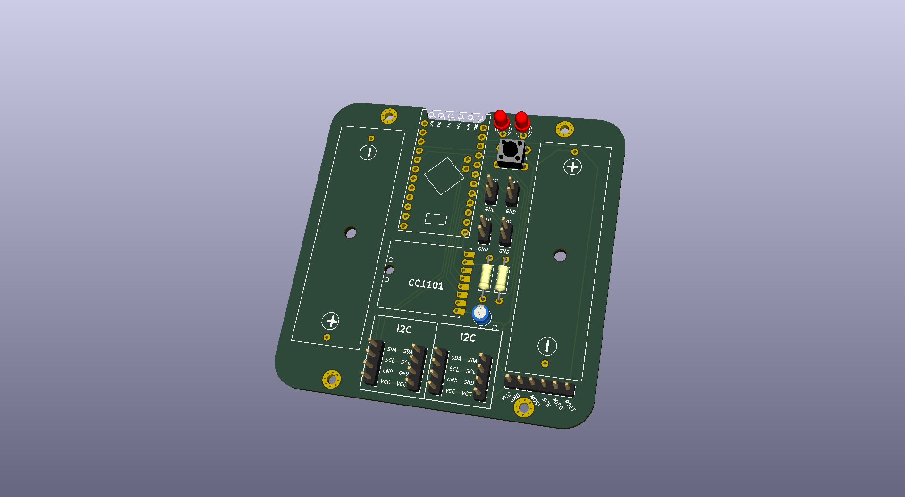
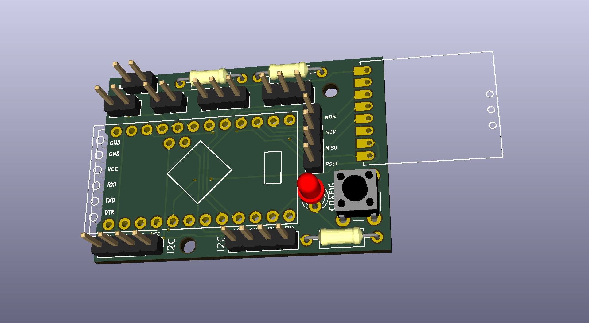

# PCB
## HB-UNI-SEN-BATT
Eine universelle Platine für Homebrew Geräte basierend auf [AskSin++ Library](https://github.com/pa-pa/AskSinPP)

[Schaltplan](HB-UNI-SEN-BATT/HB-UNI-SEN-BATT.pdf)

### Benötigte Bauteile:
* Arduino Pro Mini 3.3V 8Mhz (The Simple)
* CC1101 Modulplatine 868MHz
* 2x LEDs 3mm Low Current (Pin 4 und 5)
* 2x 470Ohm Widerstände (Vorwiderstand für LEDs)
* Elko 100uF 1,5mm
* 2x Goobay Batteriehalter Mignon Print
* Mikroschalter 6*6mm
* Stiftleiste RM 2mm 1x8 Pin (Für CC1101)
* Stiftleiste RM 2,54MM (nach Bedarf)
* IRLU024N (optional für Verpolungsschutz)
* 100KOhm Widerstand (optional für Verpolungsschutz)
* 2x 10KOhm Widerstand (optional Pullup für I2C)

### Passendes Gehäuse
* Camdenboss CBRS01SWH und CBRS01VWH

### Hinweise
* Achtung: Kein Überspannungschutz vorhanden
* Der Verpolungsschutz ist optional. Dafür Bauteil Q1 (IRLU024N) und R3 (100KOhm Widerstand) bestücken. Alternativ J8 auf der Platinenrückseite brücken um ohne Verpolungsschutz zu arbeiten.

## HB-UNI-SEN-PCB
Eine universelle Platine für Homebrew Geräte basierend auf [AskSin++ Library](https://github.com/pa-pa/AskSinPP)

[Schaltplan](HB-UNI-SEN-PCB/HB-UNI-SEN-PCB.pdf)

### Benötigte Bauteile:
* Arduino Pro Mini 3.3V 8Mhz (The Simple)
* CC1101 Modulplatine 868MHz
* 1x LEDs 3mm Low Current (Pin 4)
* 1x 470Ohm Widerstände (Vorwiderstand für LEDs)
* Mikroschalter 6*6mm
* Stiftleiste RM 2mm 1x8 Pin (Für CC1101)
* Stiftleiste RM 2,54MM (nach Bedarf)
* Optional: 2x 10KOhm Widerstand und 2x 10KOhm PTC (Temperaturmessung mit PTC an A0 und A1)

### Hinweise
* Achtung: kein Verpolungs- oder Überspannungschutz vorhanden
* Am I2C sind keine Pullups vorhanden, da diese im Regelfall auf I2C Platinen bereits integriert sind
* Aktuell fehlt noch ein Kondensator am VCC vom CC1101.

## HB-UNI-SEN-O
### Work in progress, do not use